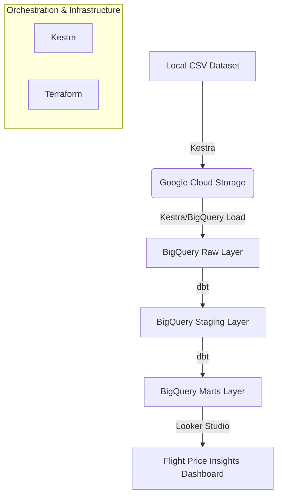
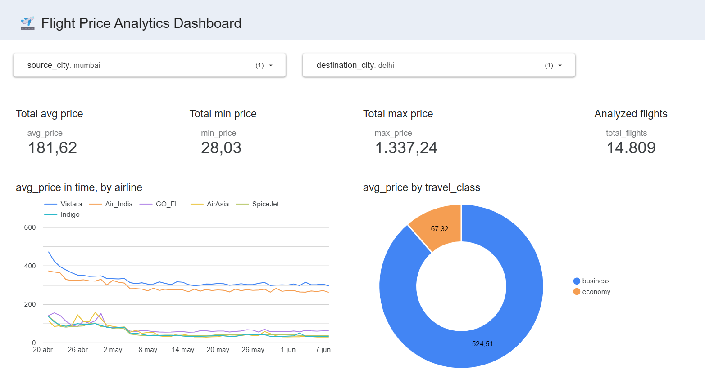
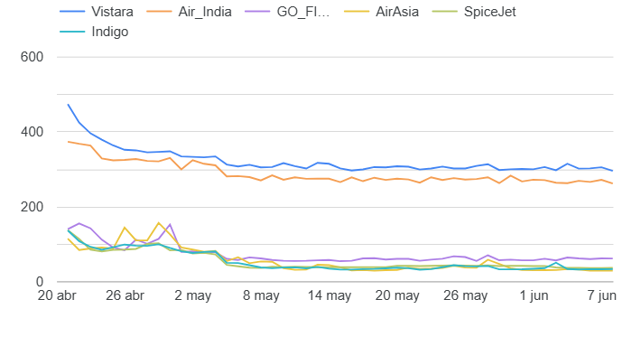

<p align="center">
  
</p>

# Flight Price Analytics 🛫

An end-to-end batch data pipeline designed to analyze flight price patterns and determine optimal booking windows using the Google Cloud Platform (GCP) ecosystem.

## 📖 Problem Statement

Planning a trip often involves the stressful task of deciding when to buy flight tickets. Prices fluctuate based on various factors such as airline, cabin class, and most importantly, how many days are left before the flight.

This project aims to solve this by:
1.  **Ingesting** historical flight data into a cloud data lake.
2.  **Transforming** raw data into analytical models to identify price trends.
3.  **Visualizing** the distribution of prices and their correlation with time-to-departure (`days_left`).

The ultimate goal is to provide data-driven insights that help travelers understand the trade-offs between booking early vs. last-minute for different airlines.

## 📊 Dataset

We use the [Flight Price Prediction Dataset](https://www.kaggle.com/datasets/shubhambathwal/flight-price-prediction) from Kaggle.
- **Main file:** `Clean_Dataset.csv`
- **Key attributes:** Airline, Source/Destination City, Departure/Arrival Time, Stops, Class, Duration, Days Left, and Price.

---

## 🛠️ Tech Stack

-   **Cloud Provider:** Google Cloud Platform (GCP)
-   **Infrastructure as Code (IaC):** Terraform
-   **Workflow Orchestration:** Kestra
-   **Data Lake:** Google Cloud Storage (GCS)
-   **Data Warehouse:** BigQuery
-   **Data Transformation:** dbt (Data Build Tool)
-   **Data Visualization:** Looker Studio (formerly Data Studio)

---

## 🏗️ Architecture

The pipeline follows a modern data stack architecture:



### Data Pipeline Details:
1.  **Ingestion:** Kestra fetches the local CSV, converts it to **Parquet** for storage efficiency, and uploads it to a GCP Bucket.
2.  **Loading:** A BigQuery Load Job is triggered by Kestra to move data from GCS to the `raw` dataset.
3.  **Transformation (dbt):**
    -   **Staging:** Cleans column names (snake_case) and casts data types.
    -   **Marts:** Creates an optimized, partitioned (by flight date), and clustered (by airline and route) table for analysis.
4.  **Reporting:** Looker Studio connects to the dbt-processed table in BigQuery.

---

## 🚀 How to Reproduce

### 1. Prerequisites
- [Google Cloud Account](https://cloud.google.com/) with a project created.
- [Docker](https://www.docker.com/) and Docker Compose installed.
- [Terraform](https://www.terraform.io/) installed.
- [GCP Service Account](https://cloud.google.com/iam/docs/service-accounts) with `Storage Admin`, `BigQuery Admin`, and `Editor` roles.

### 2. Infrastructure Setup (Terraform)
1.  Navigate to the `terraform/` directory.
2.  Copy the example variables file:
    ```bash
    cp terraform.tfvars.example terraform.tfvars
    ```
3.  Fill in your `GCP_PROJECT_ID` and desired region in `terraform.tfvars`.
4.  Initialize and apply:
    ```bash
    terraform init
    terraform apply
    ```

### 3. Orchestration (Kestra)
1.  Ensure your GCP credentials are saved as `secrets/gcloud-credentials.json`.
2.  Start Kestra using Docker Compose:
    ```bash
    cd kestra
    docker-compose up -d
    ```
3.  Access the UI at `http://localhost:8080`.
4.  **Important:** Configure project variables:
    -   Go to the **Flows** section and find **`00_set_variables`**.
    -   Edit the flow to replace `YOUR_PROJECT_ID` and other placeholders with your specific GCP details.
    -   **Run the flow** to initialize the internal Key-Value store.
5.  Run the **`01_flight_price_pipeline`** flow to ingest and process the data.

### 4. Data Transformation (dbt)
The transformation layer is fully orchestrated by Kestra:
1.  **Orchestrated Run:** Use the **`02_dbt_daily_run`** flow in Kestra to execute all dbt models and tests.
2.  **Scheduling:** This flow is configured to run automatically **every day at 09:00 (UTC-3)**.
3.  **Manual Execution (Optional):** If you need to test dbt locally for development:
    ```bash
    cd dbt
    pip install dbt-bigquery==1.6.0
    export GCP_PROJECT_ID=... # Set your variables
    dbt run
    dbt test
    ```

---

## 📈 Visualizations

The final dashboard, **Flight Price Insights Dashboard**, provides two main views:

1.  **Categorical Distribution:** Average price per Class (Economy vs. Business).
2.  **Temporal Trend:** Price evolution based on `days_left` before the flight.

[Link to dashboard](https://datastudio.google.com/s/lSIvuYXYRpI)

### Dashboard Preview





---

## 🔗 Project Links
- **Dataset:** [Kaggle](https://www.kaggle.com/datasets/shubhambathwal/flight-price-prediction)
- **Course:** [Data Engineering Zoomcamp](https://github.com/DataTalksClub/data-engineering-zoomcamp)